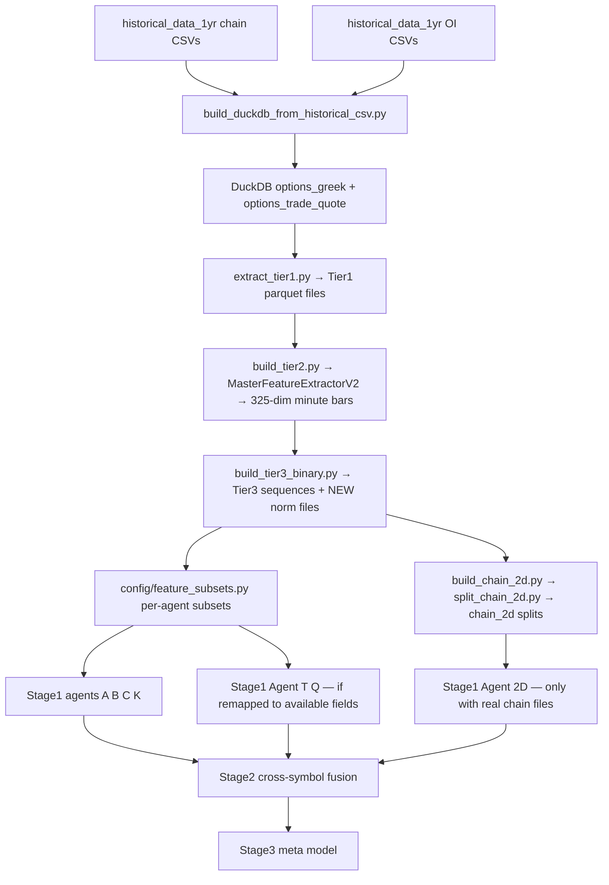
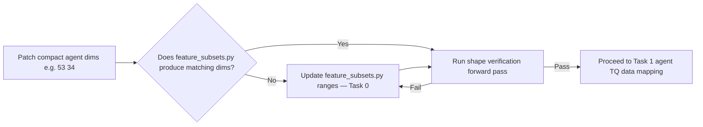

# Hybrid52 Wiring and Retraining Alignment Plan (Revised)

## Overview
The goal is to retain Hybrid52 by making the new training tree fully wired end-to-end against the actual data source at `/workspace/historical_data_1yr`. The existing agent rewrites introduced a fundamental feature contract mismatch that must be resolved before any other work proceeds.

## Critical Pre-Condition (Resolve Before Anything Else)
Several agents were redesigned this session to use compact input dimensions:
- `agent_a.py`: `input_dim=53`
- `agent_b.py`: `input_dim=34` for sequence, implied `static_dim=53`
- `agent_c.py`: `input_dim=34` for sequence, `static_dim=53`
- `agent_k.py`: `input_dim=53`
- `agent_t.py`: `trade_feat_dim=25` with narrow specialized domain
- `agent_q.py`: `quote_feat_dim=20` with narrow specialized domain

At the same time, `config/feature_subsets.py` still slices a **325-dim shared tensor** using old ranges like `(0, 50)`, `(50, 100)` etc. These two things cannot coexist silently. Every agent will crash on the first training run because the subset slices will produce vectors whose dimensions do not match what the patched agents expect.

This is not a Task 4 consideration — it is **Step 0**, and every subsequent task depends on its resolution.

## Data Source Summary
Historical chain CSVs and OI CSVs at `/workspace/historical_data_1yr` contain:

**Reliably populated fields:**
- `timestamp`, `underlying_price`, `strike`, `right`, `expiration`, `dte`, `cp_sign`
- `bid`, `ask`, `mid`, `spread`, `spread_pct`
- `bid_size`, `ask_size`
- `delta`, `gamma`, `vega`, `theta`, `vanna`, `charm`, `implied_vol`, `lambda`
- `moneyness`, `dist_atm_pct`
- OI files: `open_interest` keyed on `expiration`, `strike`, `right`, `query_date`

**Near-empty or structurally absent:**
- `open`, `high`, `low`, `close` → always 0 in EOD chain snapshots
- `volume`, `count`, `vwap` → zero for 95%+ of contracts
- `bid_exchange`, `ask_exchange` → categorical, not numeric signal
- Real OPRA trade/quote conditions such as `ext_condition1-4`, `condition` → not present in chain history files

This means Agent T and Agent Q's specialized feature domains must be explicitly mapped to what the historical data actually provides. There is no reliable OPRA trade-flow data in this source.

---

## Corrected Execution Order

| Step | Task | Dependency |
|---|---|---|
| 0 | Feature contract decision and agent-subset realignment | None — must come first |
| 1 | Agent T / Agent Q data-availability decision | Depends on Step 0 |
| 2 | Namespace and import cleanup | Safe after Step 0 |
| 3 | Artifact root standardisation | Safe after Step 0 |
| 4 | Norm file regeneration policy | Depends on Step 0 |
| 5 | Phase 0 pipeline alignment | Depends on Steps 0–4 |
| 6 | chain_2d contract cleanup | Depends on Step 5 |
| 7 | Doc and preflight synchronisation | Final step |

---

## Task 0 — Feature contract decision (Step 0 blocker)
### Problem
Two incompatible assumptions currently coexist in the Hybrid52 tree:
- **Legacy assumption**: a shared 325-dim Tier3 sequence tensor is the universal input. `feature_subsets.py` defines agent views as index ranges over that tensor.
- **Redesigned assumption**: each agent directly receives compact input vectors of its own natural dimension such as 53 or 34.

These cannot coexist unless the integration layer is explicit. Currently there is no integration layer — they just silently conflict.

### Two valid paths forward

#### Option A — Keep 325-dim shared tensor, update subsets to match new agent dims
- Tier2/Tier3 pipeline stays on 325-dim shared representation
- `feature_subsets.py` must be rewritten so every agent's subset range slice produces the exact dimension each patched agent expects
- Agent A must receive exactly 53 dimensions from its subset slice
- Agent B must receive exactly 34 dimensions as its sequence slice and 53 as its static slice
- This is achievable if the 325-dim layout actually contains features corresponding to the 53 real Theta fields and the 34 per-contract sequence fields

#### Option B — Compact tensors become canonical, retire the shared 325-dim path
- Build new Tier2/Tier3 artifacts that directly encode the compact per-agent representations
- `feature_subsets.py` is replaced by per-agent feature extractors built directly on the historical CSV schema
- Much more work, but architecturally cleaner

### Recommended decision
Use **Option A** but with explicit verification. The 325-dim layout does contain feature groups that map onto the compact agent redesigns because the compact designs were derived from that knowledge. However, the subset ranges must be recalculated to produce the exact dimensions the patched agents expect, and this must be verified before any training run.

### Concrete action required before any other task
1. For each agent, identify which subset ranges in the 325-dim layout produce a vector matching the patched agent's `input_dim`
2. Update `feature_subsets.py` so each agent's `feat_dim` matches the patched agent's constructor expectation
3. Verify numerically that the slice produces the right shape before training

### Files involved
- `/workspace/ Hybrid52_New training/config/feature_subsets.py`
- `/workspace/ Hybrid52_New training/hybrid52_models/agents/agent_a.py`
- `/workspace/ Hybrid52_New training/hybrid52_models/agents/agent_b.py`
- `/workspace/ Hybrid52_New training/hybrid52_models/agents/agent_c.py`
- `/workspace/ Hybrid52_New training/hybrid52_models/agents/agent_k.py`
- `/workspace/ Hybrid52_New training/hybrid52_models/agents/agent_t.py`
- `/workspace/ Hybrid52_New training/hybrid52_models/agents/agent_q.py`
- `/workspace/ Hybrid52_New training/hybrid52_models/independent_agent.py`

### Verification test
Before proceeding to any other task, run a shape-only forward pass for all agents using a dummy Tier3 sequence of shape `(batch, 20, 325)` and confirm no shape errors. This is a train-time proxy — if it passes, the contracts are aligned.

---

## Task 1 — Agent T and Agent Q data-availability resolution
### Problem
Agent T is designed around trade flow features: sweep detection, block trades, aggression ratios, volume per minute, CVD, OPRA trade conditions. Agent Q is designed around quote dynamics: quote update frequency, cancel rate, bid/ask pressure, CVD momentum.

None of these features exist reliably in the `/workspace/historical_data_1yr` chain snapshot data. These files are EOD option chain snapshots, not OPRA trade/quote streams. The `options_trade_quote` table that the Phase 0 DuckDB builder creates is populated from sparse `volume`, `count`, and `vwap` fields that are near-empty for most contracts.

This means Agents T and Q will train on near-empty tensors even after all architectural fixes — which is worse than no training because the network will converge on noise.

### Decision required
Choose one of three paths:

#### Path 1 — Remap Agent T and Agent Q to use fields that actually exist
Fields that genuinely carry quote and market-structure signal from the historical chain data are:
- `bid_size`, `ask_size`, `spread`, `spread_pct`
- `bid`, `ask` (for spread dynamics)
- Greeks by strike for quote-pressure proxies

Remap Agent T and Agent Q to use these fields. Explicitly redesign their `trade_feat_dim` and `quote_feat_dim` to match available data. Document this remapping in `feature_config_agent_a.py` or a new `feature_config_agents_tq.py`.

#### Path 2 — Disable Agent T and Agent Q for this retrain
Skip these two agents entirely for the historical-data-based retrain. Mark them as requiring a live OPRA TQ data source. Save all architecture improvements but do not include them in Stage 1 training until a real TQ source is available.

#### Path 3 — Source real TQ data
If a live or alternative TQ source exists in `/workspace/data/data_in_2026` or elsewhere, verify it and wire it into the Phase 0 flow before including Agents T and Q.

### Recommended direction
Use **Path 1** for the near term. The most practically available proxy for quote pressure is the bid_size/ask_size imbalance and spread dynamics already in the chain history. Redesign the feature domains so the agents are specialists in what the data actually provides, not what an ideal OPRA stream would provide.

### Files involved
- `/workspace/ Hybrid52_New training/hybrid52_models/agents/agent_t.py`
- `/workspace/ Hybrid52_New training/hybrid52_models/agents/agent_q.py`
- `/workspace/ Hybrid52_New training/hybrid52_preprocessing/feature_config_agent_a.py`
- New file: `/workspace/ Hybrid52_New training/hybrid52_preprocessing/feature_config_agents_tq.py`
- `/workspace/ Hybrid52_New training/config/feature_subsets.py`

---

## Task 2 — Remove Hybrid51 namespace dependencies from Hybrid52 code
### Why this is safe after Step 0 but not before
Namespace cleanup is cosmetic relative to the feature-contract crash. Doing it first is safe but it won't prevent training failures. It is correctly placed here after the contract is resolved.

### Files to amend

#### `scripts/phase0/build_tier2.py`
- imports `hybrid51_preprocessing.*` → change to `hybrid52_preprocessing.*`
- has a fallback path pointing to `/workspace/Hybrid51/5. hybrid51_stage3` → remove or make conditional
- imports `tier2_reprocess` via `importlib` from old stage3 location → either inline the logic or rewrite the import to resolve within the Hybrid52 tree

#### `scripts/stage1/train_binary_agents_v2.py`
- imports `from hybrid51_models.independent_agent import IndependentAgent` → change to `hybrid52_models`
- imports `from hybrid51_utils.artifacts import DEFAULT_TRAINING_HORIZON_MINUTES` → change to `hybrid52_utils`

#### `scripts/preflight_check.py`
- imports `from hybrid51_utils import ArtifactPaths` → change to `hybrid52_utils`
- imports `from hybrid51_utils.artifacts import DEFAULT_TRAINING_HORIZON_MINUTES` → change to `hybrid52_utils`

#### `hybrid52_utils/artifacts.py`
- uses `HYBRID51_ARTIFACT_ROOT` and `HYBRID51_DATA_ROOT` env vars → add `HYBRID52_*` aliases, keep old as fallback with deprecation note

#### `hybrid52_preprocessing/chain_2d.py`
- imports `.feature_config` which resolves to the Hybrid51 config file → verify it resolves to `feature_config_v2` inside `hybrid52_preprocessing`

---

## Task 3 — Standardize artifact roots and output paths
### Risk
Different scripts write to different locations. Old artifacts from Hybrid51 training runs may be silently read by Hybrid52 scripts if default roots are not updated. This can cause wrong norm stats, mismatched checkpoints, or misleading evaluation metrics.

### Required artifact path policy
All Hybrid52 training outputs should write to and read from:
- Tier1: `/workspace/data/tier1_2026_duckdb` or a new `/workspace/data/tier1_hybrid52`
- Tier2: `/workspace/data/tier2_minutes_2026_duckdb` or clearly named new root
- Tier3: a new root like `/workspace/data/tier3_binary_hybrid52` to avoid mixing with old `tier3_binary_v5`
- Stage1 results: `/workspace/ Hybrid52_New training/results/stage1`
- Stage2 results: `/workspace/ Hybrid52_New training/results/stage2_cross`
- Stage3 results: `/workspace/ Hybrid52_New training/results/stage3`
- chain_2d: `/workspace/data/chain_2d_hybrid52`

### Files to amend
- `/workspace/ Hybrid52_New training/hybrid52_utils/artifacts.py`
- `/workspace/ Hybrid52_New training/scripts/stage1/train_binary_agents_v2.py` — `DEFAULT_DATA_ROOT`, `DEFAULT_OUTPUT_ROOT`, `DEFAULT_CHAIN_2D_DIR`
- `/workspace/ Hybrid52_New training/scripts/phase0/build_tier3_binary.py` — `TIER2_ROOT`, `OUTPUT_ROOT`
- `/workspace/ Hybrid52_New training/scripts/phase0/build_tier2.py` — `OUTPUT_ROOT`, `TIER1_GREEK_ROOT`, `TIER1_TQ_ROOT`
- `/workspace/ Hybrid52_New training/scripts/preflight_check.py` — `PATHS.data_root`

### Key principle
Never read from `tier3_binary_v5` for new Hybrid52 training. That path contains norm files and sequences computed over the old 325-dim Hybrid51 feature set. Using those norm files with Hybrid52 agents will produce silently wrong normalization.

---

## Task 4 — Norm file regeneration policy
### Problem (Missing from original plan)
All agents trained on compact feature dimensions such as 53 or 34 need normalization statistics computed from the actual training split of the Hybrid52 data. The old `norm_mean.npy` and `norm_std.npy` files inside `tier3_binary_v5` were computed over the 325-dim feature set. These indices correspond to completely different features in the old layout. Using them with patched agents will silently destroy input scaling.

### Affected files
- `tier3_binary_v5/<symbol>/horizon_30min/norm_mean.npy`
- `tier3_binary_v5/<symbol>/horizon_30min/norm_std.npy`
- `tier3_binary_v5/<symbol>/horizon_30min/zero_variance_mask.npy`

### Required action
All norm files must be regenerated from new Tier3 data built from the historical archive. This happens automatically inside `build_tier3_binary.py` if run against new data with the correct feature dimension. It is therefore gated on Tasks 0 and 5 completing first.

### Verification required before Stage 1 training
After new Tier3 is built, confirm:
- `norm_mean.npy` shape matches the actual `feat_dim` written into `metadata.json`
- `norm_std.npy` shape matches
- `zero_variance_mask.npy` shape matches
- No old norm files from `tier3_binary_v5` are referenced in any Hybrid52 script

### Files involved
- `/workspace/ Hybrid52_New training/scripts/phase0/build_tier3_binary.py`
- `/workspace/ Hybrid52_New training/scripts/stage1/train_binary_agents_v2.py`
- New Tier3 root defined in Task 3

---

## Task 5 — Phase 0 pipeline alignment
### Goal
Confirm the full pipeline from historical CSV to Tier3 produces correct artifacts with no silent assumptions from the old Hybrid51 data flow.

### Sub-tasks

#### 5.1 Verify historical data preflight
Run `preflight_historical_data_1yr.py` against all symbols to confirm:
- required columns present in sample files
- timestamp parseable
- OI files present for all symbols
- no hard gaps in date coverage

#### 5.2 DuckDB build
Run `build_duckdb_from_historical_csv.py` and confirm:
- both `options_greek` and `options_trade_quote` tables populate correctly
- `options_greek` is populated from chain CSV real fields
- `options_trade_quote` is populated but expected to be sparse for most volume/condition fields

#### 5.3 Tier1 extraction
Confirm `extract_tier1.py` produces per-trade-date parquet files for Greek and TQ with correct columns.

#### 5.4 Tier2 build
This step requires resolving the `build_tier2.py` import issue from Task 2 first. After namespace cleanup, confirm:
- `master_extractor_v2.py` is called correctly
- output parquet files have the expected `features` column with 325-dim vectors
- coverage of the trade/quote-dependent feature groups is logged and assessed

#### 5.5 Tier3 build
After Tier2 is confirmed:
- run `build_tier3_binary.py` with `--output-root` pointing to the new Hybrid52 Tier3 path defined in Task 3
- confirm zero-variance mask flags the expected sparse groups
- confirm normalization stats are saved inside the new output root
- confirm chain_2d column is produced or explicitly absent

### Feature group reliability map to produce during 5.4–5.5
Based on actual data availability, each feature group should be classified as:
- **High confidence**: driven by reliably populated real fields (Greeks, IV surface, OI, spread, bid/ask)
- **Partial confidence**: relies on fields that are populated but sparse
- **Low confidence or absent**: driven by empty fields in the historical data

| Feature Group | Dim range | Expected reliability |
|---|---|---|
| Core Greeks (bucket) | 0–74 | High |
| Gamma Exposure | 75–104 | High |
| Vanna/Charm | 105–124 | High |
| IV Surface | 125–149 | High |
| Flow/Volume | 150–179 | Low — volume/count empty |
| Microstructure | 180–199 | Medium — spread/bid available |
| Walls/Positioning | 200–219 | High — OI walls available |
| Cross-Strike | 220–234 | High |
| Time Decay | 235–249 | High |
| Sentiment/Regime | 250–269 | Medium |
| Smart Money | 270–284 | Low — needs real TQ |
| Volume Anomaly | 285–296 | Low — volume empty |
| Trade Conditions | 297–306 | Low — OPRA conditions absent |
| Quote Pressure | 307–324 | Medium — bid_size/ask_size available |

---

## Task 6 — chain_2d contract cleanup
### Status of agent_2d patch
According to session work on 2026-03-24, the synthetic fallback in `agent_2d.py` was already patched to emit a `RuntimeWarning` instead of silently training on Gaussian noise. **Do not re-apply this patch.** Verify the patch is present before making any changes to `agent_2d.py`.

### Verification step
Confirm the following in `/workspace/ Hybrid52_New training/hybrid52_models/agents/agent_2d.py`:
- when `chain_2d=None`, the code emits `RuntimeWarning` and does not silently continue with synthetic data
- if the patch is confirmed, mark this as done and do not modify the file

### Remaining chain_2d wiring issues
Even with the fallback patched, the pipeline has shape and path inconsistencies that need to be resolved.

#### File naming contract
- `build_chain_2d.py` writes: `<symbol>_chain_2d_train.npy`
- `split_chain_2d.py` reads monolithic and writes: `train_chain_2d.npy`, `val_chain_2d.npy`, `test_chain_2d.npy`
- Stage1 loader looks for co-located split files first, then monolithic fallback

This flow is actually correct. The issue is that `split_chain_2d.py` must be run before Stage1, and there is no automated step that does this in the execution sequence. It must be made explicit in the README.

#### Shape contract
The current setup uses these shapes:
- build output: `(N, 5, 30, 20)` — 5 Greeks, 30 strike bins, 20 timesteps
- Tier3 builder: `CHAIN_OUTPUT_STRIKES = 20`, crops from center of 30 → `(N, 5, 20, 20)` after transpose to `(N, 5, 20, 20)` → stored as `(N, 5, 20, seq_len)`
- `agent_2d.py` constructor: `n_strikes=20`, `n_timesteps=20`

This center-crop during Tier3 build creates a shape mismatch if build_chain_2d is run with 30 strikes and the Tier3 builder does not explicitly crop. Confirm this crop is happening correctly inside `_build_chain_batch` and that the stored shape is `(N, 5, 20, 20)` not `(N, 5, 30, 20)`.

### Locked chain_2d contract
| Property | Value |
|---|---|
| Builder output shape | (N, 5, 30, 20) |
| Stored split shape after Tier3 crop | (N, 5, 20, 20) |
| Model input shape in agent_2d.py | (B, 5, 20, 20) |
| Build source | `/workspace/historical_data_1yr/<SYMBOL>/` chain CSVs |
| Monolithic file | `/workspace/data/chain_2d_hybrid52/<SYMBOL>_chain_2d_train.npy` |
| Split files | `/workspace/data/tier3_binary_hybrid52/<SYMBOL>/horizon_30min/train_chain_2d.npy` etc. |
| Failure behavior | RuntimeWarning + skip Agent 2D, never silent synthetic fallback |

---

## Task 7 — Docstring, README, and preflight synchronisation
### Goal
All user-facing documentation and preflight scripts should describe the real Hybrid52 workflow with correct dimensions, paths, and known constraints.

### Files to update
- `/workspace/ Hybrid52_New training/README.md` — must describe the corrected execution order from this revised plan
- `/workspace/ Hybrid52_New training/PLAN.md` — update to reflect feature contract decision
- `/workspace/ Hybrid52_New training/scripts/preflight_check.py` — after namespace fix in Task 2, extend to check norm file consistency
- Module docstrings in all patched agents — update `input_dim` and comments to match actual values
- `/workspace/cursor-context-hybrid52.md` — add a session note about the five problems corrected in this revised plan

### Preflight additions required
After Task 2 namespace fix, `preflight_check.py` should additionally verify:
- norm mean and std shapes match the expected feature dim for the current tier3 root
- chain_2d split files exist or monolithic file exists, for Agent 2D to be enabled
- no Hybrid51 artifact paths are being referenced as data sources

---

## Revised Architecture Diagram

---

## Amended File Priority Matrix

| File | Problem | Required Amendment | Blocks |
|---|---|---|---|
| `config/feature_subsets.py` | Subset ranges don't produce dims that match patched agents | Recalculate ranges to produce 53, 34 etc. | Step 0 |
| `hybrid52_models/independent_agent.py` | Agent creation passes full subset dim as input_dim to patched agents | Verify static_dim / seq_dim separation for B, C, T, Q | Step 0 |
| `hybrid52_models/agents/agent_a.py` | input_dim=53 set | Verify matches feature_subsets.py A-subset after fix | Step 0 |
| `hybrid52_models/agents/agent_b.py` | input_dim=34 seq + static_dim=53 | Both dims must come from correct subset slices | Step 0 |
| `hybrid52_models/agents/agent_c.py` | Same as B | Same as B | Step 0 |
| `hybrid52_models/agents/agent_k.py` | input_dim=53 | Verify matches feature_subsets.py K-subset | Step 0 |
| `hybrid52_models/agents/agent_t.py` | trade_feat_dim=25 expects real TQ fields | Remap to available chain CSV fields | Task 1 |
| `hybrid52_models/agents/agent_q.py` | quote_feat_dim=20 expects real TQ fields | Remap to available chain CSV fields | Task 1 |
| `scripts/phase0/build_tier2.py` | Imports hybrid51_preprocessing | Change to hybrid52_preprocessing | Task 2 |
| `scripts/stage1/train_binary_agents_v2.py` | Imports hybrid51_models, hybrid51_utils, old data roots | Change imports and roots | Tasks 2 and 3 |
| `scripts/preflight_check.py` | Imports hybrid51_utils, old roots | Change imports, extend norm checks | Tasks 2, 3, 7 |
| `hybrid52_utils/artifacts.py` | HYBRID51 env var names, old tier3_binary_v5 root | Rename or alias, new tier3 root | Task 3 |
| `scripts/phase0/build_tier3_binary.py` | Old output root | Update OUTPUT_ROOT, TIER2_ROOT defaults | Task 3 |
| `hybrid52_preprocessing/chain_2d.py` | Still imports .feature_config | Verify resolves to feature_config_v2 correctly | Task 6 |
| `hybrid52_models/agents/agent_2d.py` | Synthetic fallback patch status unknown | Verify patch present, do not re-apply | Task 6 |
| `README.md` | Describes old Hybrid51 pipeline | Rewrite for Hybrid52 corrected order | Task 7 |

---

## Acceptance Criteria

Training can start only when all of the following are confirmed:

1. A shape-only forward pass for all agents with a dummy input tensor of shape `(batch, 20, 325)` completes without shape errors
2. `feature_subsets.py` computed dims match patched agent `input_dim` values for all agents
3. Agent T and Agent Q have explicit feature remapping to available historical CSV fields with documented limitations
4. All Hybrid52 scripts import only `hybrid52_*` package paths
5. All default artifact roots in all scripts point to Hybrid52-specific paths, not `tier3_binary_v5` or old Hybrid51 results
6. New norm files are generated from the new Tier3 data root, not copied from `tier3_binary_v5`
7. `agent_2d.py` synthetic fallback is confirmed patched with `RuntimeWarning` only
8. chain_2d contract is explicitly locked in code and documentation
9. `preflight_check.py` validates norm file shapes against current feature dimension
10. Zero old Hybrid51 artifact paths appear in any Hybrid52 training log
