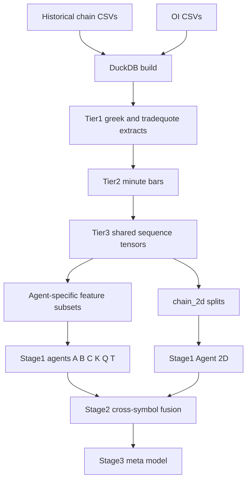
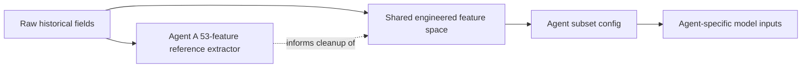

# Hybrid52 Wiring and Retraining Alignment Plan

## Overview
The goal is to retain the Hybrid52 model direction while making sure the new training tree is fully wired end-to-end against the actual data source at `/workspace/historical_data_1yr`.

The main issue is not the raw data itself. The historical chain CSVs and OI CSVs contain enough real information to support the feature cleanup strategy. The bigger problem is that the new training folder is still a hybrid of:
- legacy Hybrid51 package/import names,
- legacy artifact/output roots,
- a legacy 325-feature global Tier2/Tier3 pipeline,
- and newer Hybrid52 agent changes that expect compact feature inputs such as 53 and 34 dimensions.

Because of that, retraining can easily fail in subtle ways even if individual files run in isolation. The plan below focuses on making the training tree internally consistent before any new retrain is started.

## Objectives
- Make `/workspace/ Hybrid52_New training` internally self-consistent.
- Ensure all package imports, artifact paths, and preflight logic point to the Hybrid52 tree rather than Hybrid51.
- Align the feature pipeline with the actual historical data schema.
- Resolve the contract mismatch between compact-agent redesigns and the legacy 325-feature training pipeline.
- Define a clean source-of-truth path from historical CSV/OI data through Phase 0, Tier2, Tier3, and Stage 1.

## What the Data Source Looks Like
Based on the historical files:
- Historical chain CSVs contain real populated fields such as:
  - `timestamp`
  - `underlying_price`
  - `strike`
  - `right`
  - `dte`
  - `cp_sign`
  - `bid`, `ask`, `mid`, `spread`, `spread_pct`
  - `bid_size`, `ask_size`
  - `delta`, `gamma`, `vega`, `theta`, `vanna`, `charm`, `implied_vol`, `lambda`
  - `moneyness`, `dist_atm_pct`
- OI CSVs are separate and contain at least:
  - `symbol`
  - `expiration`
  - `strike`
  - `right`
  - `timestamp`
  - `open_interest`
  - `query_date`
- Several historical chain fields are structurally empty or near-empty for this workflow:
  - `open`, `high`, `low`, `close`
  - `volume`, `count`, `vwap`
  - exchange-code style fields such as `bid_exchange`, `ask_exchange`

This supports the strategy of removing dead features and rebuilding the retained feature set only from fields that actually carry signal.

## Current Wiring Problems Identified

### Namespace / import drift
Several Hybrid52 files still import `hybrid51_*` modules or use Hybrid51 wording, which makes the new tree dependent on old naming.

### Artifact root drift
Some scripts still default to old artifact/output roots such as Hybrid51 result folders or old tier roots.

### Feature contract drift
There are two competing assumptions in the tree:
1. the old shared 325-feature Tier2/Tier3 representation,
2. the new compact-agent redesigns using 53/34-dimensional inputs.

These are not automatically compatible and need an explicit integration strategy.

### Chain-2D shape/path inconsistency
There are conflicting expectations around chain-2d shapes and where monolithic versus split files should live.

### Preflight mismatch
Preflight and helper scripts still validate against Hybrid51 package roots and default artifact conventions, which can falsely report success or failure.

---

## Task List

## Task 1 — Establish the Hybrid52 source-of-truth contract
### Goal
Create one explicit architecture contract for the new training tree so every script and model uses the same assumptions.

### Decisions to lock
- Which parts of the pipeline remain on the 325-feature shared representation.
- Which parts consume compact per-agent subsets derived from that representation.
- Whether Agent A’s new 53-feature extractor is:
  - a documentation/reference module only,
  - an auxiliary branch for one agent,
  - or the new canonical snapshot representation.

### Required outcome
A short design note inside the training tree should define:
- canonical package namespace,
- canonical artifact root,
- canonical Tier2/Tier3 data roots,
- canonical flat feature dimension for shared training,
- canonical chain_2d shape and file layout,
- which agents rely on compact subsets versus shared input tensors.

### Files involved
- `/workspace/ Hybrid52_New training/README.md`
- `/workspace/ Hybrid52_New training/PLAN.md`
- `/workspace/cursor-context-hybrid52.md`

---

## Task 2 — Remove Hybrid51 namespace dependency from Hybrid52 code
### Goal
Make the new training tree self-contained so it does not import old Hybrid51 packages by name.

### Why this matters
Right now the tree can silently work only because file structures are similar. That is fragile and makes the new training directory not truly independent.

### Files to amend
- `/workspace/ Hybrid52_New training/scripts/phase0/build_tier2.py`
  - currently imports `hybrid51_preprocessing.*`
  - also points fallback paths at old stage3 locations
- `/workspace/ Hybrid52_New training/scripts/stage1/train_binary_agents_v2.py`
  - currently imports `hybrid51_models.independent_agent`
  - currently imports `hybrid51_utils.artifacts`
- `/workspace/ Hybrid52_New training/scripts/preflight_check.py`
  - currently imports `hybrid51_utils.*`
- `/workspace/ Hybrid52_New training/scripts/split_chain_2d.py`
  - references old Tier3 output examples
- `/workspace/ Hybrid52_New training/hybrid52_models/independent_agent.py`
  - currently imports `config.feature_subsets` correctly, but its surrounding comments/testing still present as Hybrid51
- `/workspace/ Hybrid52_New training/hybrid52_preprocessing/chain_2d.py`
  - imports `.feature_config`, but comments and external references still describe Hybrid51 behavior
- `/workspace/ Hybrid52_New training/hybrid52_utils/artifacts.py`
  - still uses `HYBRID51_*` environment variable names and old defaults

### Amendment rules
- Replace package imports so Hybrid52 scripts use `hybrid52_*` modules throughout.
- Rename comments, logging labels, and defaults so diagnostics clearly identify Hybrid52.
- Keep compatibility only where explicitly needed, not by accident.

---

## Task 3 — Standardize artifact roots and output paths
### Goal
Ensure every phase writes to and reads from the same Hybrid52 artifact tree.

### Current risk
Different scripts point to different places:
- old Hybrid51 results folders,
- old Tier2/Tier3 data roots,
- local defaults under unrelated directories.

This can cause retraining to read stale artifacts, save into the wrong tree, or mix old checkpoints with new code.

### Files to amend
- `/workspace/ Hybrid52_New training/hybrid52_utils/artifacts.py`
- `/workspace/ Hybrid52_New training/scripts/stage1/train_binary_agents_v2.py`
- `/workspace/ Hybrid52_New training/scripts/preflight_check.py`
- `/workspace/ Hybrid52_New training/scripts/phase0/build_tier2.py`
- `/workspace/ Hybrid52_New training/scripts/phase0/build_tier3_binary.py`

### Required alignment
Define one path policy for:
- Tier1 root
- Tier2 root
- Tier3 root
- chain_2d root
- Stage1 results
- Stage2 results
- Stage3 results

### Recommended rule
All defaults should point into either:
- the Hybrid52 training tree itself, or
- clearly named shared `/workspace/data/...` directories that are already the intended source-of-truth.

The key requirement is internal consistency across all readers and writers.

---

## Task 4 — Resolve the feature-dimension contract mismatch
### Goal
Make the redesigned agents and the Phase 0/Stage 1 pipeline agree on what each tensor means.

### Current mismatch
The training system still largely assumes a shared `325`-dimensional sequence tensor. But several agents in Hybrid52 were rewritten as if their true inputs are compact domains such as:
- Agent A: `53`
- Agent B: `34` sequence + `53` static conceptually
- Agent C: `34` sequence + `53` static conceptually
- Agent K: `53`
- Agent Q/T: narrower specialized quote/trade domains

At the same time, `config/feature_subsets.py` still defines subsets over the old 325-feature layout.

### Required decision
Pick one of these two integration strategies:

#### Option A — Keep 325 as the canonical shared tensor
- Tier2/Tier3 stay on the shared 325-feature sequence.
- Compact-agent redesigns are interpreted as consuming selected subspaces of the 325-vector.
- Agent-specific code must therefore use subset dimensions consistent with `feature_subsets.py`, not independent hardcoded dimensions unless those subsets are rebuilt accordingly.

#### Option B — Introduce a new compact canonical snapshot spec
- Rebuild the entire data pipeline so Tier2/Tier3 directly emit new compact tensors.
- Rewrite subset config, Stage1 loader assumptions, and normalization logic around the new compact feature families.

### Recommended direction
Use **Option A** first.
It is the safer retention path because most of the pipeline already depends on the 325-feature shared representation. The compact redesigns can be preserved as agent-local views derived from that shared tensor.

### Concrete files to audit and amend
- `/workspace/ Hybrid52_New training/config/feature_subsets.py`
- `/workspace/ Hybrid52_New training/hybrid52_models/independent_agent.py`
- `/workspace/ Hybrid52_New training/hybrid52_models/agents/agent_a.py`
- `/workspace/ Hybrid52_New training/hybrid52_models/agents/agent_b.py`
- `/workspace/ Hybrid52_New training/hybrid52_models/agents/agent_c.py`
- `/workspace/ Hybrid52_New training/hybrid52_models/agents/agent_k.py`
- `/workspace/ Hybrid52_New training/hybrid52_models/agents/agent_q.py`
- `/workspace/ Hybrid52_New training/hybrid52_models/agents/agent_t.py`

### What to verify in each file
- input dimensions match the subset actually passed in
- comments reflect real dimensions
- static-vs-sequence semantics are consistent
- no hidden truncation/padding is masking a shape mismatch
- feature subset ranges still correspond to the actual 325-feature layout

---

## Task 5 — Reconcile Agent A’s new 53-feature extractor with the main pipeline
### Goal
Decide how the new Agent A extractor participates in retraining.

### Findings
The files:
- `/workspace/ Hybrid52_New training/hybrid52_preprocessing/feature_config_agent_a.py`
- `/workspace/ Hybrid52_New training/hybrid52_preprocessing/extract_agent_a_features.py`

correctly reflect the real historical/OI schema and the desire to drop dead Theta columns.

### Open integration issue
These files are currently not the main source of truth for Tier2/Tier3 generation. The broader pipeline still uses the older `master_extractor_v2` / `feature_config_v2` path.

### Required integration choice
Either:
- keep them as a specialized extractor for Agent A documentation/prototyping, or
- explicitly wire them into the main feature build path.

### Recommended direction
For retention, keep the shared Tier2/Tier3 pipeline intact first, and use the new Agent A extractor as:
- a validation reference for which raw historical columns are truly informative,
- a guide for removing dead columns from future shared feature engineering,
- and a possible later replacement for Agent A-specific snapshot construction.

### Files to document against each other
- `/workspace/ Hybrid52_New training/hybrid52_preprocessing/feature_config_agent_a.py`
- `/workspace/ Hybrid52_New training/hybrid52_preprocessing/extract_agent_a_features.py`
- `/workspace/ Hybrid52_New training/hybrid52_preprocessing/feature_config_v2.py`
- `/workspace/ Hybrid52_New training/hybrid52_preprocessing/master_extractor_v2.py`

### Deliverable
A mapping note showing:
- which of the 53 Agent A features are already represented inside the 325-feature stack,
- which are missing,
- which legacy 325 features are dead or near-dead and should be candidates for replacement.

---

## Task 6 — Clean up the Phase 0 historical-data pipeline
### Goal
Make sure the Phase 0 flow from historical CSV/OI data to training artifacts is consistent with the real data layout.

### Data-flow path
1. historical chain CSVs + OI CSVs
2. DuckDB build
3. Tier1 extraction
4. Tier2 minute bars
5. Tier3 binary sequences
6. Stage1 agent training

### Files involved
- `/workspace/ Hybrid52_New training/scripts/phase0/preflight_historical_data_1yr.py`
- `/workspace/ Hybrid52_New training/scripts/phase0/build_duckdb_from_historical_csv.py`
- `/workspace/ Hybrid52_New training/scripts/phase0/extract_tier1.py`
- `/workspace/ Hybrid52_New training/scripts/phase0/build_tier2.py`
- `/workspace/ Hybrid52_New training/scripts/phase0/build_tier3_binary.py`

### Specific checks
#### 6.1 Historical column assumptions
Confirm all required historical chain fields are present and consistently typed:
- `timestamp`
- `underlying_price`
- `bid`, `ask`
- `strike`, `right`, `expiration`
- Greeks and higher-order Greeks where needed

#### 6.2 OI join semantics
Ensure OI is joined by the correct keys:
- `expiration`
- `strike`
- `right`
- trade/query date

#### 6.3 Trade/quote table expectations
Current DuckDB construction creates `options_trade_quote` partly from sparse historical fields like `volume`, `count`, `vwap`, which are weak in these CSV snapshots.
That means many trade/quote-derived features may remain sparse unless another true TQ source exists.

### Implication
The new plan should distinguish between:
- reliable chain/greek/OI features,
- partially available trade/quote proxies,
- and truly missing trade/quote information.

### Required deliverable
A per-feature-group reliability table for the 325-feature stack:
- high-confidence groups driven by real data,
- degraded groups driven by sparse or synthetic proxies,
- groups that should be dropped or redesigned.

---

## Task 7 — Fix chain_2d path and shape consistency
### Goal
Ensure Agent 2D can be trained using real chain tensors without hidden shape or path mismatches.

### Findings
There are multiple chain_2d expectations across files:
- builder produces monolithic files like `<symbol>_chain_2d_train.npy`
- split helper creates `train_chain_2d.npy`, `val_chain_2d.npy`, `test_chain_2d.npy`
- Stage1 loader expects co-located split files first, then monolithic fallback
- comments in different files disagree on strike/time dimensions

### Files involved
- `/workspace/ Hybrid52_New training/hybrid52_preprocessing/build_chain_2d.py`
- `/workspace/ Hybrid52_New training/hybrid52_preprocessing/chain_2d.py`
- `/workspace/ Hybrid52_New training/scripts/split_chain_2d.py`
- `/workspace/ Hybrid52_New training/scripts/stage1/train_binary_agents_v2.py`
- `/workspace/ Hybrid52_New training/hybrid52_models/agents/agent_2d.py`

### Required alignment
Lock one standard for:
- monolithic build file naming
- split file naming
- expected tensor shape in storage
- expected tensor shape in model forward pass
- strike count and timestep count after any center crop or slicing

### Important issue to resolve
`agent_2d.py` still creates synthetic fallback data after warning when `chain_2d=None`. The intended retained behavior should be strict:
- no silent training on fake chain data,
- either skip the agent or fail loudly.

### Deliverable
A single chain_2d contract documented as:
- build shape
- storage location
- split location
- model input shape
- failure behavior when chain data is absent.

---

## Task 8 — Reconcile comments, docs, and defaults with actual behavior
### Goal
Reduce operator confusion by making docs reflect the current Hybrid52 implementation.

### Why this matters
A large part of the tree still describes itself as Hybrid51 or describes dimensions/paths that no longer match the code. That makes future retraining error-prone even if the code itself is fixed.

### Files to update for consistency
- `/workspace/ Hybrid52_New training/README.md`
- `/workspace/ Hybrid52_New training/PLAN.md`
- `/workspace/ Hybrid52_New training/FORENSIC_STUDY_FINDINGS.md`
- `/workspace/ Hybrid52_New training/Stage 2+3 Pipeline Automation.md`
- module docstrings in key scripts and model files

### Required content corrections
- Hybrid52 naming
- actual default data roots
- actual artifact roots
- actual feature dimensions
- actual chain_2d conventions
- actual retraining blockers and prerequisites

---

## Task 9 — Add a wiring audit checklist before retraining
### Goal
Create a lightweight acceptance checklist so retraining starts only after all critical paths are aligned.

### Checklist sections
#### Namespace integrity
- no Hybrid51 package imports remain in Hybrid52 execution path unless intentional compatibility wrappers are documented

#### Path integrity
- all Phase 0, Stage1, Stage2, Stage3 scripts point to the same data and result roots

#### Feature integrity
- subset dimensions match agent input dimensions
- 325-feature shared tensor assumptions are explicit
- dead-feature handling is documented and reproducible

#### Data integrity
- historical CSV and OI joins succeed for all target symbols
- sparse trade/quote groups are identified rather than silently trusted

#### Chain integrity
- Agent 2D only trains with real split chain files or explicit failure

### Files to attach checklist to
- `/workspace/ Hybrid52_New training/scripts/preflight_check.py`
- `/workspace/ Hybrid52_New training/README.md`

---

## Task 10 — Prioritize amendments in execution order
### Goal
Make the work sequence safe and dependency-aware.

### Priority order
1. **Namespace and artifact-root cleanup**
   - without this, later outputs may go to the wrong place
2. **Feature contract decision and subset alignment**
   - without this, agent training may be dimensionally inconsistent
3. **Phase 0 path/data-source alignment**
   - without this, new data artifacts may not match the intended pipeline
4. **chain_2d contract cleanup**
   - without this, Agent 2D may still train incorrectly or fail inconsistently
5. **Docstring/README/preflight synchronization**
   - makes the retained workflow repeatable

---

## Core Change Map by File

### High priority
- `scripts/phase0/build_tier2.py`
  - replace Hybrid51 imports/fallback paths
  - point to Hybrid52 preprocessing package only
- `scripts/stage1/train_binary_agents_v2.py`
  - replace Hybrid51 imports
  - fix default output roots
  - verify chain_2d strictness
- `scripts/preflight_check.py`
  - replace Hybrid51 utility imports
  - validate Hybrid52 artifact locations
- `hybrid52_utils/artifacts.py`
  - rename env var conventions or add Hybrid52-native aliases
  - fix default roots
- `config/feature_subsets.py`
  - verify subset ranges against current intended 325 layout and compact-agent redesign assumptions
- `hybrid52_models/independent_agent.py`
  - align agent construction with actual subset/static/seq semantics

### Medium priority
- `hybrid52_preprocessing/chain_2d.py`
  - make chain contract explicit
- `hybrid52_preprocessing/build_chain_2d.py`
  - verify symbol/file discovery and output naming
- `scripts/split_chain_2d.py`
  - align path examples and naming with Hybrid52 roots
- `README.md`
  - update architecture description and execution order

### Strategy / documentation priority
- `hybrid52_preprocessing/feature_config_agent_a.py`
- `hybrid52_preprocessing/extract_agent_a_features.py`
- `hybrid52_preprocessing/feature_config_v2.py`
- `hybrid52_preprocessing/master_extractor_v2.py`
  - create an explicit mapping between the compact cleaned feature view and the legacy shared feature view

---

## Recommended Architecture View

## Feature Alignment Principle

---

## Acceptance Criteria
The training tree should be considered fully wired when all of the following are true:
- Hybrid52 scripts no longer rely on Hybrid51 package imports as their normal execution path.
- Default artifact roots and data roots are internally consistent across Phase 0 through Stage 3.
- The feature-dimension contract is explicit and no agent depends on accidental truncation or padding.
- The historical/OI data flow is documented and validated against actual field availability.
- Sparse trade/quote-derived feature groups are identified and handled intentionally.
- chain_2d build, split, and training paths agree on file names and tensor shapes.
- Agent 2D cannot silently continue on synthetic data.
- The README and supporting docs describe the real Hybrid52 workflow.

## Final Deliverables
- A file-by-file amendment list for `/workspace/ Hybrid52_New training`
- A single Hybrid52 path and namespace contract
- A feature-contract decision note explaining how compact-agent redesigns coexist with the shared 325-feature pipeline
- A data reliability map for feature groups based on the historical/OI source
- A retraining readiness checklist

## Suggested Immediate Next Output
The next useful document should be a **surgical amendment matrix** with columns like:
- file path
- current issue
- why it breaks wiring
- required amendment
- dependency on other files
- retrain impact

That matrix will let you update Hybrid52 systematically without losing the retention work already completed.