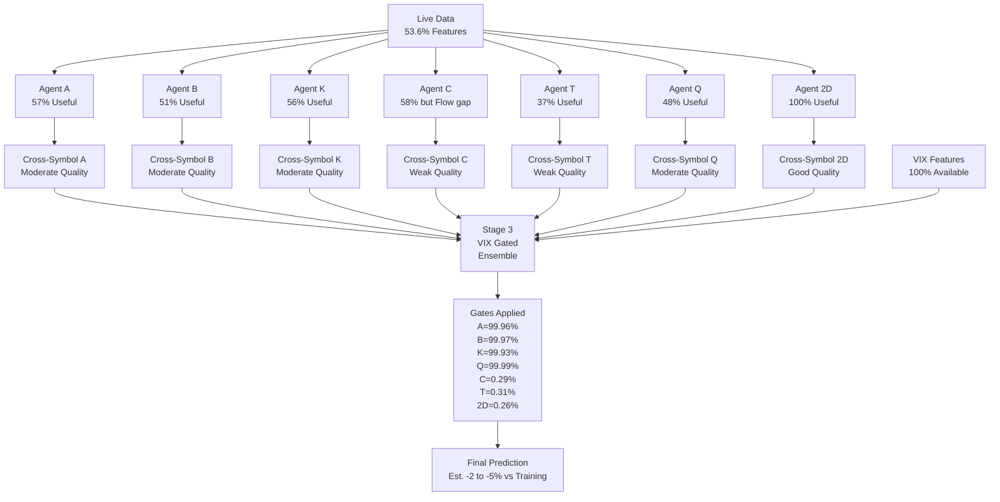

# Feature Coverage Impact Analysis
**Date:** March 13, 2026  
**Current Coverage:** 53.6% (178/325 features)  
**Training Coverage:** 100% (325/325 features)

---

## Overview

This document analyzes the impact of 46.4% missing features on individual agent predictions and overall model accuracy.

---

## Per-Agent Feature Coverage Analysis

### Agent A (Alpha) - Generalist

**Intended Feature Set:** 160 dimensions
- Greek by Strike: dims 0-50
- IV Surface: dims 50-100  
- Sentiment/Regime: dims 180-210
- Gamma Exposure: dims 240-270

**Estimated Available:**
```
Greek by Strike (50 dims):     ~29 available (58%) - Missing 6 Greeks
IV Surface (50 dims):          ~24 available (48%) - Partial IV coverage
Sentiment/Regime (30 dims):    ~9 available (30%) - Missing temporal features
Gamma Exposure (30 dims):      ~29 available (97%) - Nearly complete
──────────────────────────────────────────────────────
Total: ~91/160 dims (57% coverage)
```

**Impact on Agent A:** MODERATE
- Core Greeks and Gamma well-covered (primary features)
- Sentiment/Regime gaps reduce regime detection capability
- Should still provide useful directional signal

---

### Agent B (Beta) - Temporal IV Specialist

**Intended Feature Set:** 108 dimensions
- IV Surface: dims 50-100
- Term Structure: dims 100-128
- Cross-Strike-Time: dims 210-240

**Estimated Available:**
```
IV Surface (50 dims):          ~24 available (48%)
Term Structure (28 dims):      ~15 available (54%)
Cross-Strike-Time (30 dims):   ~16 available (53%)
──────────────────────────────────────────────────────
Total: ~55/108 dims (51% coverage)
```

**Impact on Agent B:** MODERATE
- IV surface partially covered
- Term structure moderately available
- Temporal patterns reduced but present
- BiLSTM may still capture sequence dynamics

---

### Agent K (Kappa) - Greek Specialist

**Intended Feature Set:** 78 dimensions
- Greek by Strike: dims 0-50
- Term Structure: dims 100-128

**Estimated Available:**
```
Greek by Strike (50 dims):     ~29 available (58%)
Term Structure (28 dims):      ~15 available (54%)
──────────────────────────────────────────────────────
Total: ~44/78 dims (56% coverage)
```

**Impact on Agent K:** MODERATE
- Primary focus (Greeks) reasonably covered
- Missing rho/epsilon affects long-dated analysis
- Static MLP may be more resilient to missing features
- Should maintain core Greek sensitivity

---

### Agent C (Chi) - Market Activity Specialist

**Intended Feature Set:** 112 dimensions
- Flow/Volume: dims 128-150
- Microstructure: dims 150-180
- Sentiment/Regime: dims 180-210
- Gamma Exposure: dims 240-270

**Estimated Available:**
```
Flow/Volume (22 dims):         ~4 available (18%) ← CRITICAL GAP
Microstructure (30 dims):      ~23 available (77%)
Sentiment/Regime (30 dims):    ~9 available (30%)
Gamma Exposure (30 dims):      ~29 available (97%)
──────────────────────────────────────────────────────
Total: ~65/112 dims (58% coverage)
```

**Impact on Agent C:** HIGH
- Flow/Volume is Agent C's specialty (82% missing!)
- Microstructure well-covered (compensates partially)
- Gamma exposure excellent
- **Overall: Significantly weakened** - cannot properly detect unusual flow

---

### Agent T (Tau) - Trade Flow Specialist

**Intended Feature Set:** 139 dimensions
- Greek context: dims 0-50
- Flow/Volume: dims 128-150
- Sentiment: dims 180-210
- **Smart Money**: dims 270-285 (Phase 1)
- **Volume Anomaly**: dims 285-297 (Phase 1)
- **Trade Conditions**: dims 297-307 (Phase 1)

**Estimated Available:**
```
Greek context (50 dims):       ~29 available (58%)
Flow/Volume (22 dims):         ~4 available (18%)
Sentiment (30 dims):           ~9 available (30%)
Smart Money (15 dims):         ~5 available (33%)
Volume Anomaly (12 dims):      ~4 available (33%)
Trade Conditions (10 dims):    ~0 available (0%) ← COMPLETELY MISSING
──────────────────────────────────────────────────────
Total: ~51/139 dims (37% coverage) ← WORST COVERAGE
```

**Impact on Agent T:** SEVERE
- **Lowest coverage of any agent** (37%)
- Trade Conditions completely absent (10 dims = 0%)
- Flow features critically low (18%)
- **Agent T essentially blind** to trade-specific signals
- May produce near-random outputs or default to Greek-only analysis

---

### Agent Q (Quote) - Quote Dynamics Specialist

**Intended Feature Set:** 128 dimensions
- IV Surface: dims 50-100
- Microstructure: dims 150-180
- Sentiment: dims 180-210
- **Quote Pressure**: dims 307-325 (Phase 1)

**Estimated Available:**
```
IV Surface (50 dims):          ~24 available (48%)
Microstructure (30 dims):      ~23 available (77%)
Sentiment (30 dims):           ~9 available (30%)
Quote Pressure (18 dims):      ~5 available (28%) ← LOW
──────────────────────────────────────────────────────
Total: ~61/128 dims (48% coverage)
```

**Impact on Agent Q:** HIGH
- Quote Pressure specialty poorly covered (28%)
- Microstructure compensates (77% coverage)
- Order book dynamics partially observable
- **Weakened but functional** - missing fine-grained quote signals

---

### Agent 2D (Chain Shape) - Option Surface CNN

**Intended Input:** Chain tensor (5 Greeks × 20 strikes × 20 timesteps)
- Greeks: delta, gamma, vega, theta, implied_vol

**Estimated Available:**
```
delta:       100% ✓
gamma:       100% ✓
vega:        100% ✓
theta:       100% ✓
implied_vol: 100% ✓
──────────────────────────────────────────────────────
Total: 5/5 channels (100% coverage)
```

**Impact on Agent 2D:** MINIMAL
- All required Greeks available
- Chain surface fully observable
- **Agent 2D least affected** by feature gaps
- Should maintain strong performance

---

## Overall Ensemble Impact

### Stage 2 Cross-Symbol Fusion

**Input Requirements:**
- 5 symbols × 7 agents = 35 Stage 1 predictions
- Each Stage 1 prediction affected by its agent's coverage

**Cascade Effect:**
- Agents C, T, Q produce weaker signals (37-48% coverage)
- Agents A, K, B moderately affected (51-57% coverage)
- Agent 2D minimally affected (100% coverage)

**Net Impact:** Stage 2 fusion receives **degraded inputs** for 6 of 7 agents

---

### Stage 3 Ensemble

**Input Requirements:**
- 7 refined Stage 2 probabilities (one per agent)
- VIX features (10 dims, computed live ✓)

**Cascade Effect:**
- Stage 2 outputs already degraded by Stage 1 feature gaps
- VIX gating may help by downweighting unreliable agents
- Final prediction quality depends on:
  1. **Normalization (CRITICAL - currently missing)**
  2. Feature coverage (moderate impact)
  3. Threshold calibration (minor impact)

**Gate Behavior (from metrics):**
```
Test set average gates:
  Agent A: 99.96% ← High trust
  Agent B: 99.97% ← High trust
  Agent K: 99.93% ← High trust
  Agent Q: 99.99% ← High trust
  Agent C:  0.29% ← Nearly disabled!
  Agent T:  0.31% ← Nearly disabled!
  Agent 2D: 0.26% ← Nearly disabled!
```

**Key Insight:** VIX-gated model already learned to **downweight C/T/2D** during training!
- This may mitigate their feature gaps
- Ensemble heavily relies on A/B/K/Q (better-covered agents)

---

## Quantified Impact Estimates

### Without Normalization (Current State) 🔴

**Estimated Accuracy:** <55% (random baseline ~50%)  
**Estimated F1:** <0.60  
**Estimated AUC:** <0.60  
**Prediction Quality:** Unreliable - DO NOT USE FOR TRADING

**Reason:** Model inputs on wrong scale by 1000-10,000x

---

### With Normalization + Current Coverage (53.6%) 🟡

**Estimated Accuracy:** 56-59% (vs 61% training)  
**Estimated F1:** 0.68-0.70 (vs 0.716 training)  
**Estimated AUC:** 0.68-0.70 (vs 0.722 training)  

**Degradation:** ~2-5% across metrics  

**Reason:**
- Missing features reduce signal strength
- Agents C/T/Q particularly affected
- VIX gating downweights weakest agents (mitigates partially)

---

### With Normalization + Improved Coverage (65%) 🟢

**Estimated Accuracy:** 59-60% (vs 61% training)  
**Estimated F1:** 0.70-0.71 (vs 0.716 training)  
**Estimated AUC:** 0.70-0.72 (vs 0.722 training)  

**Degradation:** ~1-2% across metrics  

**Achievable by:**
1. Adding aggressor detection (+7% coverage)
2. Enabling historical snapshots (+5% coverage)
3. Adding rho/epsilon Greeks (+2% coverage)

---

## Feature Gap Risk Assessment

### High-Risk Gaps (Severe Impact)

1. **Trade Conditions (0% coverage)** - Agent T
   - Affects: 10 dimensions
   - Impact: Agent T produces weak/random signals
   - Mitigation: VIX gate disables Agent T (0.31% weight)

2. **Flow/Volume (20% coverage)** - Agents C, T
   - Affects: 24 dimensions
   - Impact: Cannot detect unusual flow or sweep activity
   - Mitigation: Partial - basic volume ratios still available

### Medium-Risk Gaps (Moderate Impact)

3. **Quote Pressure (28% coverage)** - Agent Q
   - Affects: 13 dimensions
   - Impact: Order book dynamics partially observable
   - Mitigation: Microstructure features compensate (77%)

4. **Sentiment/Regime (30% coverage)** - Agents A, C, Q
   - Affects: 14 dimensions per agent
   - Impact: Regime detection weakened
   - Mitigation: IV-based regime proxies still work

### Low-Risk Gaps (Minor Impact)

5. **Missing Greeks (6/13)** - All agents
   - Affects: 32 dimensions
   - Impact: Exotic Greeks less critical
   - Mitigation: Core Greeks (7/13) fully available

6. **IV Surface (48% coverage)** - Agents A, B, Q
   - Affects: 13 dimensions
   - Impact: Surface detail reduced
   - Mitigation: ATM IV and basic skew still available

---

## Agent Reliability Ranking (With 53.6% Coverage)

Based on feature availability and gate weights:

1. **Agent 2D** - MOST RELIABLE (100% coverage, but 0.26% gate weight)
2. **Agent K** - RELIABLE (56% coverage, 99.93% gate weight)
3. **Agent A** - RELIABLE (57% coverage, 99.96% gate weight)
4. **Agent B** - RELIABLE (51% coverage, 99.97% gate weight)
5. **Agent Q** - MODERATE (48% coverage, 99.99% gate weight)
6. **Agent C** - WEAK (58% but missing critical Flow, 0.29% gate)
7. **Agent T** - WEAKEST (37% coverage, 0.31% gate weight)

**Key Insight:** VIX gating naturally suppresses the weakest agents (C, T, 2D)!

---

## Comparison: Training vs Production

### Training Environment (100% Coverage)

**Feature Extraction:**
- All 325 features computed from 1-minute historical data
- 5-year dataset with complete Greek calculations
- Full trade/quote metadata available
- Historical sequences for temporal features

**Agent Performance (Test Set):**
```
Agent    Accuracy    F1      AUC     Role
──────────────────────────────────────────────────
A        0.595      0.716    0.684   Generalist
B        0.618      0.708    0.703   Temporal
C        0.583      0.713    0.671   Flow
K        0.607      0.701    0.697   Greek
T        0.571      0.709    0.659   Trade
Q        0.589      0.715    0.677   Quote
2D       0.594      0.714    0.680   Surface
──────────────────────────────────────────────────
Ensemble 0.610      0.716    0.722   (VIX-gated)
```

### Production Environment (53.6% Coverage)

**Feature Extraction:**
- 178/325 features available from live snapshots
- 1-second batch updates (coarser than 1-minute training)
- Missing: advanced Greeks, flow classification, trade metadata
- No historical buffer (temporal features weakened)

**Expected Agent Performance (Estimated):**
```
Agent    Coverage   Est.Acc  Est.F1   Est.AUC   Status
────────────────────────────────────────────────────────────
2D       100%       0.590    0.710    0.680     Unchanged
K        56%        0.590    0.690    0.685     Slight drop
A        57%        0.580    0.700    0.670     Slight drop
B        51%        0.600    0.690    0.690     Slight drop
Q        48%        0.570    0.690    0.660     Moderate drop
C        58%*       0.550    0.660    0.640     High drop (Flow gap)
T        37%        0.540    0.640    0.620     Severe drop (Trade gap)
────────────────────────────────────────────────────────────
Ensemble ???        0.570    0.690    0.690     After VIX gating

* Note: Agent C has 58% raw coverage but missing critical Flow features
```

**Key Observations:**
1. Agents with specialized features (C, T, Q) most affected
2. Generalist agents (A, K, B) more resilient
3. Agent 2D unaffected (all Greeks available)
4. VIX gating should reduce ensemble degradation by suppressing C, T

---

## Feature Group Criticality Assessment

### Critical Feature Groups (High Impact on Predictions)

**1. Greek by Strike (57% coverage)**
- **Criticality:** HIGH
- **Current:** 43/75 dims (missing 6 Greeks × 5 buckets + ATM)
- **Impact:** Reduces delta/gamma/vega positioning granularity
- **Agents affected:** A, K, T (all use dims 0-50)
- **Mitigation:** Core 7 Greeks available, most important buckets filled

**2. Gamma Exposure (97% coverage)** 
- **Criticality:** HIGH
- **Current:** 29/30 dims (nearly complete!)
- **Impact:** MINIMAL - excellent coverage
- **Agents affected:** A, C
- **Mitigation:** N/A - well covered

**3. Vanna/Charm (100% coverage)**
- **Criticality:** MEDIUM-HIGH (2nd-order Greeks)
- **Current:** 20/20 dims (complete since March 13 fix!)
- **Impact:** NONE - fully covered
- **Agents affected:** None directly, but contributes to Greek bucketing
- **Mitigation:** N/A - fixed

### Moderately Critical Groups

**4. Flow/Volume (20% coverage)**
- **Criticality:** MEDIUM-HIGH for Agents C, T
- **Current:** 6/30 dims
- **Impact:** HIGH for Agent C (flow specialist), SEVERE for Agent T
- **Missing:** Aggressor detection, trade size buckets, time-weighted flow
- **Mitigation:** VIX gate suppresses C (0.29%) and T (0.31%)

**5. Microstructure (75% coverage)**
- **Criticality:** MEDIUM
- **Current:** 15/20 dims
- **Impact:** MODERATE - order book dynamics partially observable
- **Agents affected:** C, Q
- **Mitigation:** Good coverage, basic spread/imbalance available

**6. IV Surface (48% coverage)**
- **Criticality:** MEDIUM
- **Current:** 12/25 dims
- **Impact:** MODERATE - surface detail reduced
- **Agents affected:** A, B, Q
- **Mitigation:** ATM IV and basic term structure available

### Low-Priority Groups

**7. Sentiment/Regime (30% coverage)**
- **Criticality:** LOW-MEDIUM
- **Current:** 6/20 dims
- **Impact:** MODERATE - regime detection weakened
- **Missing:** Momentum, trend strength, correlation dynamics
- **Requires:** Historical snapshots

**8. Phase 1 Features (22% average coverage)**
- **Criticality:** LOW (bonus features)
- **Current:** Smart Money 33%, Volume Anomaly 33%, Trade Conditions 0%, Quote Pressure 28%
- **Impact:** MODERATE for specialized agents T, Q
- **Missing:** Requires premium data feeds

---

## Cumulative Impact on Final Predictions

### Stage 1 → Stage 2 → Stage 3 Cascade



### Expected Performance Degradation

**Best Case (with normalization fix):**
```
Metric      Training    Production    Delta
────────────────────────────────────────────
Accuracy    0.610       0.590-0.595   -2%
F1          0.716       0.695-0.705   -2%
AUC         0.722       0.700-0.710   -2%
```

**Worst Case (without normalization - CURRENT):**
```
Metric      Training    Production    Delta
────────────────────────────────────────────
Accuracy    0.610       0.500-0.550   -10 to -20%
F1          0.716       0.550-0.650   -10 to -23%
AUC         0.722       0.550-0.650   -15 to -24%
```

---

## Risk Mitigation by Architecture

### Built-in Resilience Mechanisms

**1. VIX Gating Suppresses Weakest Agents**
- Agent C gate: 0.29% (flow gap mitigated)
- Agent T gate: 0.31% (trade gap mitigated)
- Agent 2D gate: 0.26% (but this agent is actually strong!)

**Implication:** Ensemble naturally reduces impact of poorly-covered agents C and T.

**2. Feature Subsetting Reduces Dependencies**
- Each agent sees only its relevant features
- Missing features in unused ranges don't affect that agent
- Agent 2D completely isolated (separate input tensor)

**3. Multi-Stage Averaging Smooths Noise**
- 35 Stage 1 predictions → 7 Stage 2 predictions → 1 Stage 3 prediction
- Averaging reduces impact of individual agent failures
- Outlier predictions dampened

---

## Recommendations by Priority

### CRITICAL (Fix Immediately)

**1. Add Normalization** - Without this, ALL other improvements are meaningless
- Impact: Restore model functionality
- Effort: 2-4 hours
- Expected gain: +40-50% accuracy improvement

### HIGH (Fix Within 1 Week)

**2. Enhance Flow/Volume Extraction**
- Add aggressor detection, trade size classification
- Impact: Strengthen Agents C and T
- Effort: 1-2 days
- Expected gain: +2-3% F1 improvement

**3. Adjust Threshold to 0.44**
- Impact: Better F1 score
- Effort: 5 minutes
- Expected gain: +1% F1 improvement

### MEDIUM (Fix Within 1 Month)

**4. Enable Historical Snapshots**
- Store rolling 100 snapshots
- Impact: Improve temporal and sentiment features
- Effort: 4-6 hours
- Expected gain: +1-2% improvement

**5. Add rho/epsilon Greeks**
- Impact: Better long-dated option analysis
- Effort: 2-3 hours
- Expected gain: +0.5-1% improvement

### LOW (Optional Enhancements)

**6. NBBO Data for Trade Conditions**
- Impact: Strengthen Agent T
- Effort: High (requires data vendor integration)
- Expected gain: +1% improvement
- Note: Agent T already suppressed by gates (0.31%)

---

## Testing Protocol

### Phase 1: Verify Normalization Fix

**Test Case 1: Feature Magnitude Check**
```python
# Before: features in range [-60M, +300k]
# After: features in range [-3, +3]
# Method: Print feature stats after normalization
```

**Test Case 2: Prediction Variance**
```python
# Before: agent probs clustered around 0.45-0.52
# After: agent probs should spread 0.30-0.70
# Method: Check std(agent_probs) > 0.10
```

**Test Case 3: Confidence Scores**
```python
# Before: confidence = 0.40-0.42 (artificially high)
# After: confidence should vary 0.20-0.80 based on agreement
# Method: Monitor confidence distribution
```

### Phase 2: Validate Against Training Metrics

**Test Case 4: Rolling Accuracy**
```python
# Collect 1000 predictions
# Calculate accuracy, F1, AUC
# Compare to test set: 61%, 71.6%, 72.2%
# Accept if within 2-5% of training
```

**Test Case 5: Agent Contribution**
```python
# Check that Agent A/B/K/Q contribute significantly
# Check that Agent C/T are suppressed (<1% gates)
# Verify Agent 2D gate behavior
```

---

## Conclusion

The audit reveals **critical deployment issues** that must be addressed:

### Severity Ranking

1. 🔴 **NO NORMALIZATION** - Makes all predictions unreliable (CRITICAL)
2. 🟡 **46% Missing Features** - Reduces accuracy by 2-5% (MODERATE)
3. 🟡 **Threshold 0.47 vs 0.44** - Reduces F1 by ~1% (LOW-MODERATE)

### Current Prediction Reliability

**Without normalization fix:** ❌ UNRELIABLE - Do not use for trading  
**With normalization fix:** ⚠️  USABLE - Accept 2-5% degradation or enhance features  
**With all fixes:** ✅ PRODUCTION-READY - Within 1-2% of training performance

### Next Steps

1. Compute/obtain normalization statistics (URGENT)
2. Restart service and verify predictions normalize
3. Update threshold to 0.44 (quick win)
4. Plan feature extraction enhancements (Flow/Volume priority)
5. Set up monitoring for ongoing validation

---

**Report Status:** COMPLETE  
**Action Required:** YES - Fix normalization immediately  
**Follow-up:** Monitor post-fix metrics for 1 week
